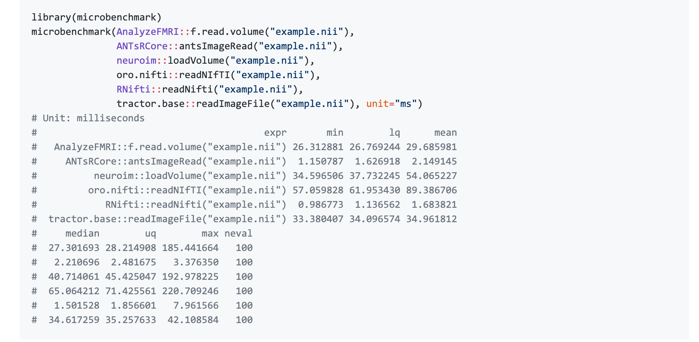
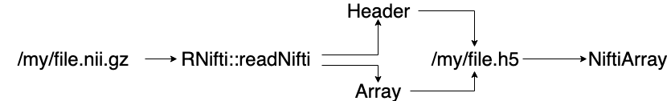

<style type="text/css">
article {
  font-size: 28pt;
}
</style>

```{r setup, include=FALSE}
knitr::opts_chunk$set(echo = TRUE)
library(RNifti)
library(fslr)
library(NiftiArray)
```


```{r, eval = TRUE, echo = FALSE}
pkg_name = "usethis"
```

<!-- SMI 2019 product -->
# Start of a Package: \n Plotting a voxel from \n 800 Subjects in a Shiny App

# How can you read in a NIfTI image in R?

## Options for reading in NIfTI images

Array like

- `oro.nifti::readNIfTI`/`neurobase::readnii`
- `AnalyzeFMRI::f.read.volume()` - can't read gzipped
- `neuroim::loadVolume("example.nii")`

C++ pointer

- `ANTsCore::antsImageRead`
- `RNifti::readNifti` 

---

From RNifti: https://github.com/jonclayden/RNifti#performance

```{r, out.width="100%", echo = FALSE, eval = TRUE}

```

## What do we want

1. Something fast
2. Has overloaded functions (e.g. `image + image = image`)
3. Can use most plotting functions on it (e.g. `ortho2`)
4. Is array like but has header
5. Keeps memory low
5. Has **random access**

## Current issues

- `oro.nifti::readNIfTI` - slow
- `ANTsCore::antsImageRead` - installation is 
- `RNifti::readNifti` - from https://github.com/jonclayden/RNifti/issues/14 :

> For your single-precision floating-point image with about 1bn elements, the "native" data size in the C struct is roughly 4 GiB, while the R array uses 8 GiB because it uses double precision. When you use readNifti(..., internal=TRUE) the resulting object has only the C struct, but with readNifti(..., internal=FALSE) the object has both the C struct and the R array, for a total of 12 GiB. 

- None have random access (just read in one slice or 1 timepoint)

## Solution: NiftiArray

- Stores image and header in HDF5 (Hierarchical Data Format) format
- Based on `HDF5Array` from Bioconductor (https://bioconductor.org/packages/release/bioc/html/HDF5Array.html)

```{r, out.width="100%", echo = FALSE, eval = TRUE}

```


## Takes longer than RNifti (the first time)

```{r, message = FALSE}
fname = fslr::mni_fname()
system.time({
  rnifti = RNifti::readNifti(fname)
})
system.time({
  narray = NiftiArray::writeNiftiArray(fname)
  narray@seed@filepath
  narray
})
```

## Sizes

```{r, message = FALSE}
format(object.size(rnifti), units = "Kb")
format(object.size(narray), units = "Kb")
```

## Header Information

```{r}
print(nifti_header(narray))
```


## Accessing voxels

```{r}
narray[18, 5, 14]
sum(narray > 9990)
narray[ narray > 9990]
DelayedArray::extract_array(narray, index = list(NULL ,NULL, 1))
```

## What are the benefits?

- Overall most benefits come from saving H5 files on "big" computer
- Random access - the `DelayedArray` package
- Operations on `DelayedArray` objects, the DelayedMatrixStats package https://bioconductor.org/packages/release/bioc/html/DelayedMatrixStats.html

## What are the benefits? Reshaping to a Matrix

```{r}
d = dim(narray)
d
dim(narray) = c(d, 1)
new_dim = c(prod(d), 1)
newarray = writeNiftiArray(narray)
mat = ReshapedNiftiArray(newarray@seed@filepath, dim = new_dim)
dim(mat)
head(mat)
```


## Why? Voxel-wise operations in low-memory setting

```{r}
big_mat = DelayedArray::acbind(mat, mat, mat)
dim(big_mat)
format(object.size(big_mat), units = "Kb")
rmed = DelayedMatrixStats::rowMedians(big_mat)
```


## Why? 4D Example

```{r}
nii_fname = system.file("extdata",
                        "example_4d.nii.gz", package = "RNifti")
from = NiftiArray::NiftiArray(nii_fname)
dim(from)
A <- ReshapedNiftiArray(filepath = from@seed@filepath,
                       name = from@seed@name,
                       dim = c(prod(dim(from)[1:3]), dim(from)[4]))
dim(A)
med = DelayedMatrixStats::rowMedians(A)
```

## Back to an image

```{r}
arr = array(med, dim = dim(from)[1:3])
med_array = writeNiftiArray(arr, header = nifti_header(from))
as(med_array, "niftiImage")
```


## Issues

- Need to write H5 file first (do in parallel on cluster)
- Memory tradeoff with speed due to chunking
- Most of this needs things in the same space


## Use cases

- Something on Shiny for speed or memory
  - shinyapps.io has very restrictive memory settings for imaging
- Analyzing 1000s of subjects together
- Pass object from R to Matlab: https://www.mathworks.com/help/matlab/ref/hdf5read.html


## Extensions 

- Anything that works with DelayedArrays should work here
- Check out Bioconductor 
- Example: `mbkmeans` - mini-batch k-means https://bioconductor.org/packages/release/bioc/html/mbkmeans.html


